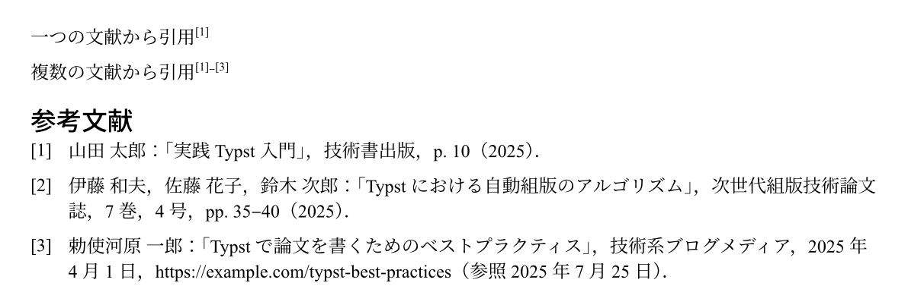

# レポート用CSL

学校のレポート用に作ったCSLファイルです。
引用文献のスタイルを指定することができます。
日本語の文章で使用することを想定しています。

[report.csl](./report.csl)

<p align="center">
  
</p>

## 使用方法

### Typst

```typst
#bibliography("works.yml", style: "report.csl")
```

文献リストはHayagriva YAMLかBibTeXかで記述できます。

### LaTeX (LuaLaTeX)

LuaLaTeXを使用する場合、`citation-style-language`パッケージを使うことでCSLを直接利用できます。

```tex
\documentclass{article}
\usepackage{citation-style-language}
\cslsetup{style = report.csl}
\addbibresource{works.bib}

\begin{document}
引用 \cite{susume}
\printbibliography
\end{document}
```

### LaTeX (Pandoc)

LaTeX (Pandoc)で使用する場合の例です。

```bash
pandoc input.md --csl=report.csl --bibliography=works.bib -o output.pdf
```

---

ライセンス：CC0 1.0 Universal
